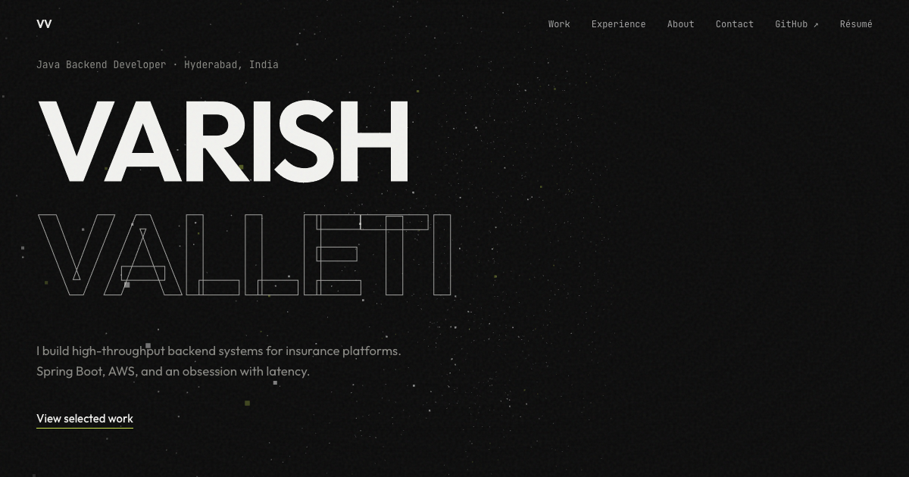

# Varish Valleti · Portfolio

Personal portfolio of a Java Backend Developer: Spring Boot, AWS, and high-throughput insurance platforms.



**Live site:** https://valletivarish52.github.io/portfolio/

## Highlights

- Cinematic preloader greeting visitors in 17 languages, shown once per session
- Three.js particle field hero with mouse parallax and scroll fade
- Sections driven entirely by one data file: `src/data/content.ts`
- 60fps motion via Framer Motion, transform/opacity only, `prefers-reduced-motion` respected
- Three.js code-split and lazy-loaded: core page is ~89 KB gzipped

## Stack

Vite · React 18 · TypeScript · Framer Motion · Three.js

## Develop

```bash
npm install
npm run dev
```

## Deploy

Pushing to `main` triggers the GitHub Actions workflow in `.github/workflows/deploy.yml`, which builds with `VITE_BASE=/portfolio/` and publishes to GitHub Pages.

To update content (projects, experience, links), edit `src/data/content.ts` only.
